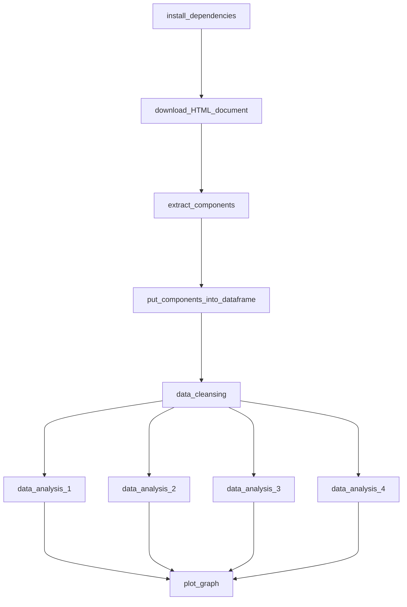

# Python WebScraping
Used beautiful soup to scrap the scrap data from Wikipedia page - List of companies of Hong Kong. Pandas is used for dataframe and matplotlib is used for creation of analytics chart

# Author
Kiki Cho

# Motivation
it is a homework, and I find it useful to train up both my python skills and webscrapping mindset

# Objective
To scrap the data about companies in Hong Kong and answer the company trends in Hong Kong

# Specification
